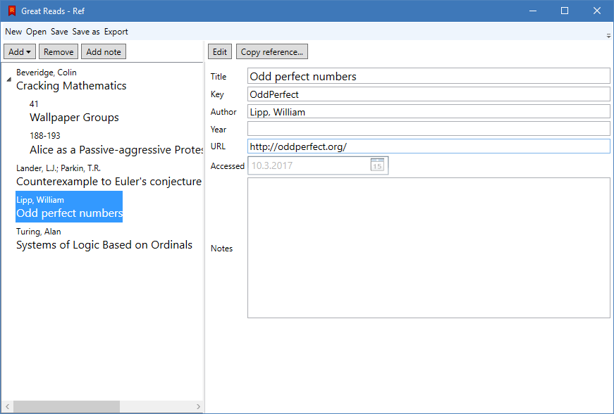

Ref is a simple tool for collecting references and citations. I have created it for my own use, finding the more professional tools way too heavy for my simple maths blogging.

### Features
* Collect references (books, articles, theses, web sites)
* Store page notes
* Export the reference list to BibTeX or Word

### Planned features
* Search the references and notes
* Import references from existing sources
* Lots of polish and improvements

## Getting Ref
:heavy_exclamation_mark: **Ref is early in development!** There are lots of rough corners and potential for bugs. Essential features are missing. Data loss may occur. New versions may have trouble reading old projects. Please keep frequent backups!

That said, I am confident enough to use this tool.

<a class="btn" href="https://github.com/polsys/Ref/releases/latest">Download Ref for Windows</a>

**Ref 0.2.0 (Released 13 March 2017)**:
* Theses and web sites!
* Export to Word!
* Manually copy references!
* Bug fixes and more!

## Questions and answers

### So how does it work?
You add books, articles, etc. and fill out their details. You can then export the bibliography to your favorite writing tool (assuming it is LaTeX or Word).

You can also add notes to the entries. These are not exported, so you can scribble anything you like.

### Who and what is this?
I am Petri Laarne (polsys on GitHub, petrilaarne on Twitter), a maths student-to-be once my gap year is over, and I blog mathematics at [Nollakohta.fi](http://www.nollakohta.fi). I love sitting in the library, and created Ref as a minimal tool for taking notes for the blog and other things.

### Is this really free?
Yup. This is a tool I wanted to make (making things is fun), and I think sharing it has just advantages. The source code is available under the MIT license.

Of course, you're going to get only your money's worth.

### How do I get this on my Mac?
There isn't a Mac version, at least for now. I don't have a Mac. Sorry :(

### Oh, that's why it's so ugly.
That was not a question.

### So how do I import my references to BibTeX/Word?
For BibTeX, please consult the [LateX Wikibook section](https://en.wikibooks.org/wiki/LaTeX/Bibliography_Management). Instead of manually editing the `.bib` file, export it from Ref.

**Note:** Web sites are exported as `@electronic` entries, which is not supported by all BibTeX styles. BibLaTeX might mess up the address. Please get in touch if you're affected by this.

For Word, the process goes as follows:
1. Export the Ref project as a `Microsoft Word sources` file.
2. Open the References tab on Word and select Manage Sources.
3. On the left side of the dialog, select Browse... and find the file you just saved.
4. The saved Ref entries appear on the Master List, where you can copy them to the Current List.
5. If you want to update some or all entries, repeat the process.

### Feature X would be *so awesome*.
I probably agree. You can peek at [the issue list](https://github.com/polsys/Ref/issues) to see if it is already planned. However, I'm doing this in my spare time and also keeping Ref intentionally simple.

### May I help out?
Sure! Try out the tool, spread the word, file [issues](https://github.com/polsys/Ref/issues) or even whip out some code yourself.

### Can I really trust this app?
Would you trust my driving? I wouldn't use the app for a doctoral thesis without *very* frequent backups, and maybe not even then. However, I think it's very nice for smaller projects.
